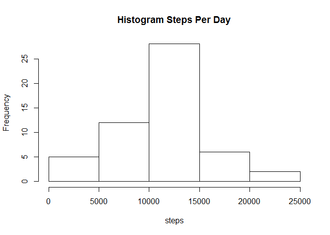
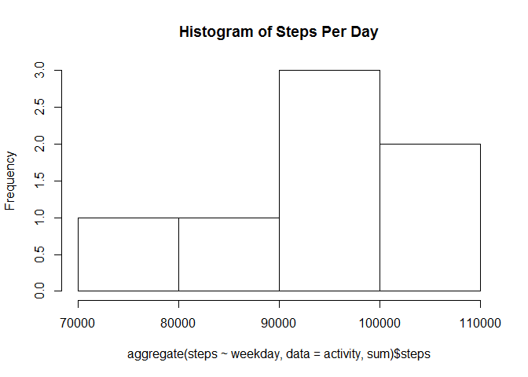
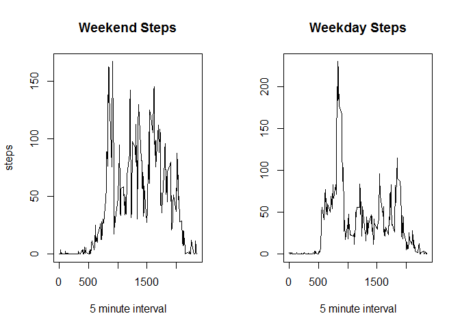

# Daily Activity Analysis
Charlie Kriefall  
March 22, 2017  


```r
knitr::opts_chunk$set(echo = TRUE)
```

## R Markdown

This document will demonstrate the exercises using a knitr document.
Code is embedded using proper markup symbols

1. Loading and preprocessing the data


```r
# 1. Loading and preprocessing the data
setwd("~/RData")

# create working directory
if (!dir.exists("activity")) dir.create("activity")
# go to working directory
setwd("activity")
# download dataset
download.file("https://d396qusza40orc.cloudfront.net/repdata%2Fdata%2Factivity.zip",destfile="activity.zip")
# unzip the file
unzip("activity.zip",overwrite=TRUE)

# load csv into a data table
library(readr)
activity <- read_csv("~/RData/activity/activity.csv", col_types = cols(date = col_date(format = "%Y-%m-%d")))
```

2. Create histogram of steps per day


```r
hist(aggregate(steps ~ date,data=activity,sum)$steps,main="Histogram Steps Per Day",xlab="steps")
```

<!-- -->

3. mean and median of the total number of steps taken per day


```r
# mean steps per day
mean(aggregate(steps ~ date,data=activity,sum)$steps)
```

```
## [1] 10766.19
```

```r
# median steps per day
median(aggregate(steps ~ date,data=activity,sum)$steps)
```

```
## [1] 10765
```

4. time series plot interval vs average steps


```r
plot(aggregate(steps ~ interval,data=activity,mean)$interval,aggregate(steps ~ interval,data=activity,mean)$steps,type="l",xlab="Interval",ylab="Steps",main="Mean Steps per Interval")
```

<!-- -->

5. identify interval with max steps


```r
# create summary table of mean steps per interval
meanStepsPerInterval<-aggregate(steps ~ interval,data=activity,mean)
subset(meanStepsPerInterval, steps == max(meanStepsPerInterval$steps), select = c(interval))
```

```
##     interval
## 104      835
```

6. Imputing missing values

Strategy: Replace NA steps with the mean value for the interval


```r
# add column meanSteps to dataset activity by joining to derived dataset meanStepsPerInterval
activity$meanSteps <- meanStepsPerInterval[match(activity$interval,meanStepsPerInterval$interval),2]
# update the NA values in steps with the value in meanSteps
activity$steps[is.na(activity$steps)] <- activity$meanSteps[is.na(activity$steps)]
```

7. Histogram of total steps per day with imputed values


```r
# add a column called weekday based on date
activity$weekday <- weekdays(activity$date)
par(mfrow=c(1,1))
hist(aggregate(steps ~ weekday,data=activity,sum)$steps,main="Histogram of Steps Per Day")
```

<!-- -->

8. Panel plot comparing the average number of steps taken per 5-minute interval across weekdays and weekends


```r
activity$IsWeekend <- activity$weekday=="Saturday"|activity$weekday=="Sunday"

# side by side panels
par(mfrow=c(1,2))
# weekend
plot(aggregate(steps ~ interval,data=activity[activity$IsWeekend,],mean)$interval,aggregate(steps ~ interval,data=activity[activity$IsWeekend,],mean)$steps,type="l",xlab="5 minute interval",ylab="steps",main="Weekend Steps")
# weekdays
plot(aggregate(steps ~ interval,data=activity[!activity$IsWeekend,],mean)$interval,aggregate(steps ~ interval,data=activity[!activity$IsWeekend,],mean)$steps,type="l",xlab="5 minute interval",ylab="",main="Weekday Steps")
```

<!-- -->

Clean Up R Environment


```r
# setwd("~/RData")
rm(list=ls())
par(mfrow=c(1,1))
```

